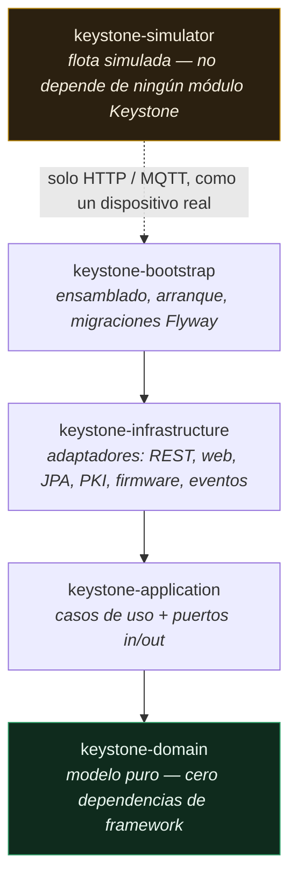
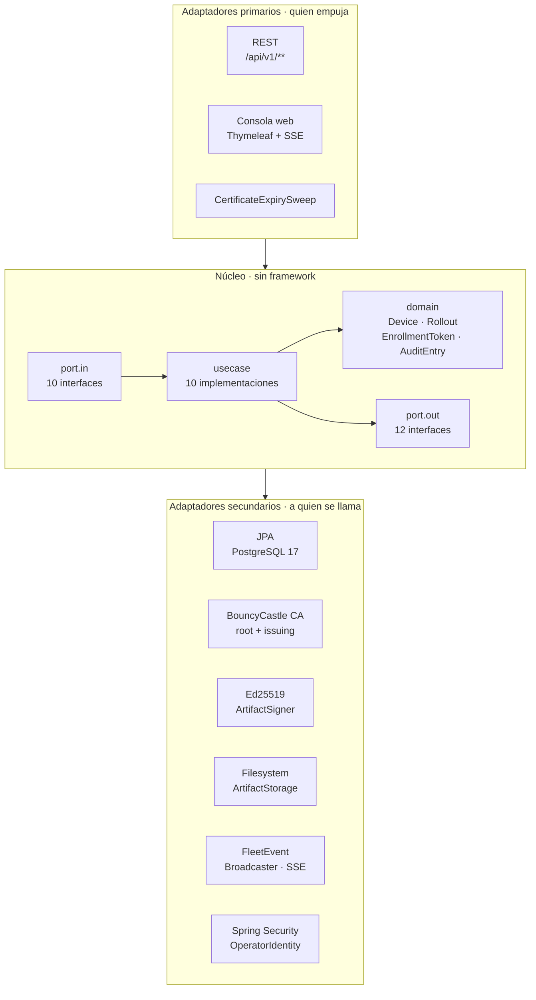
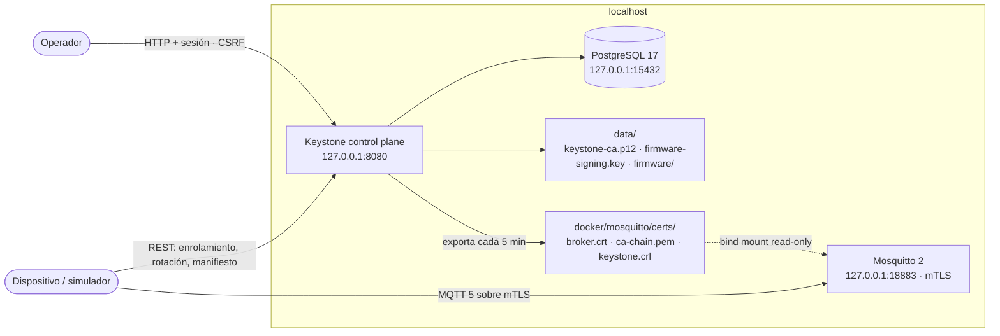
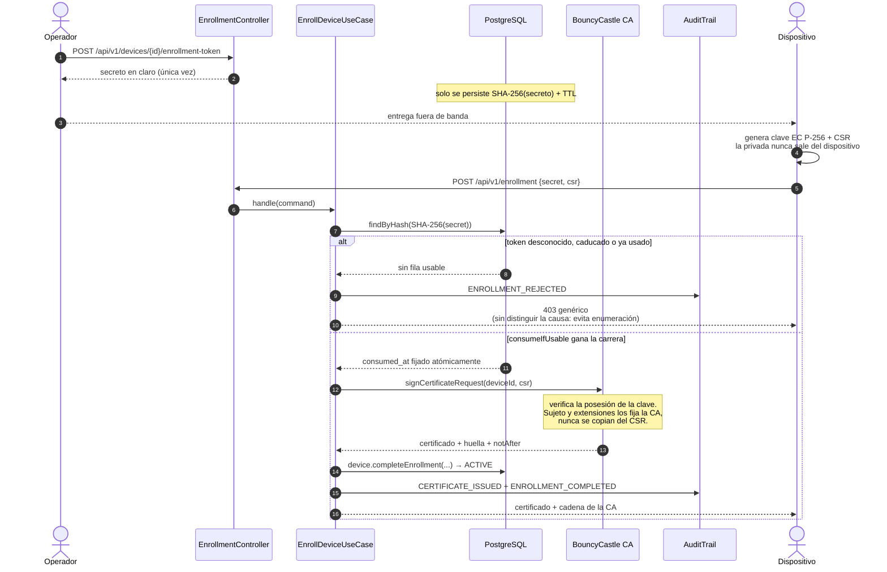
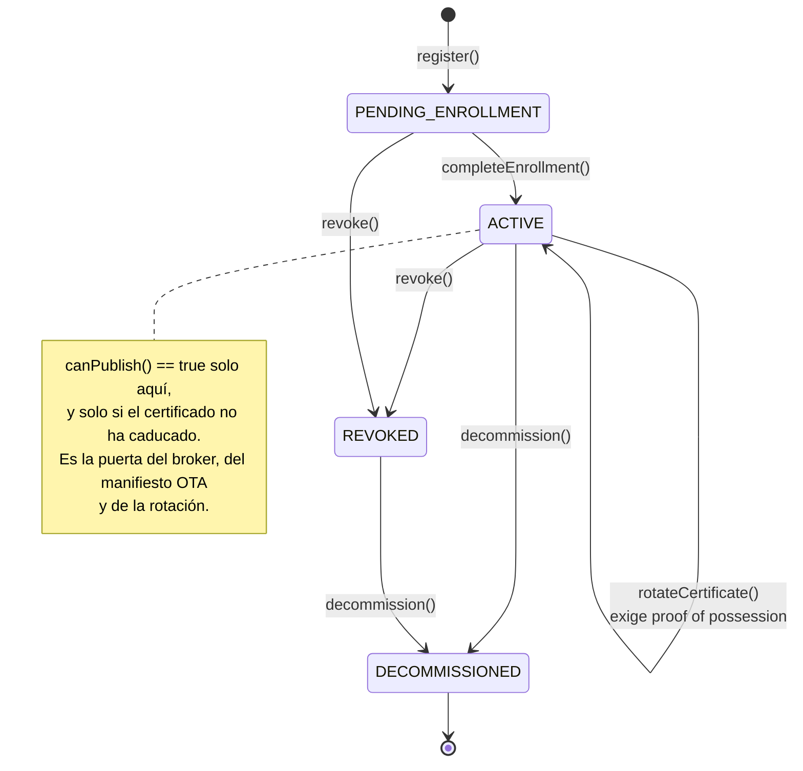
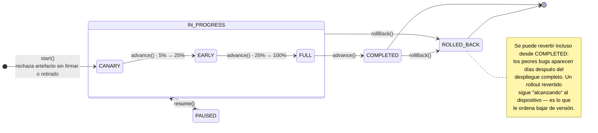
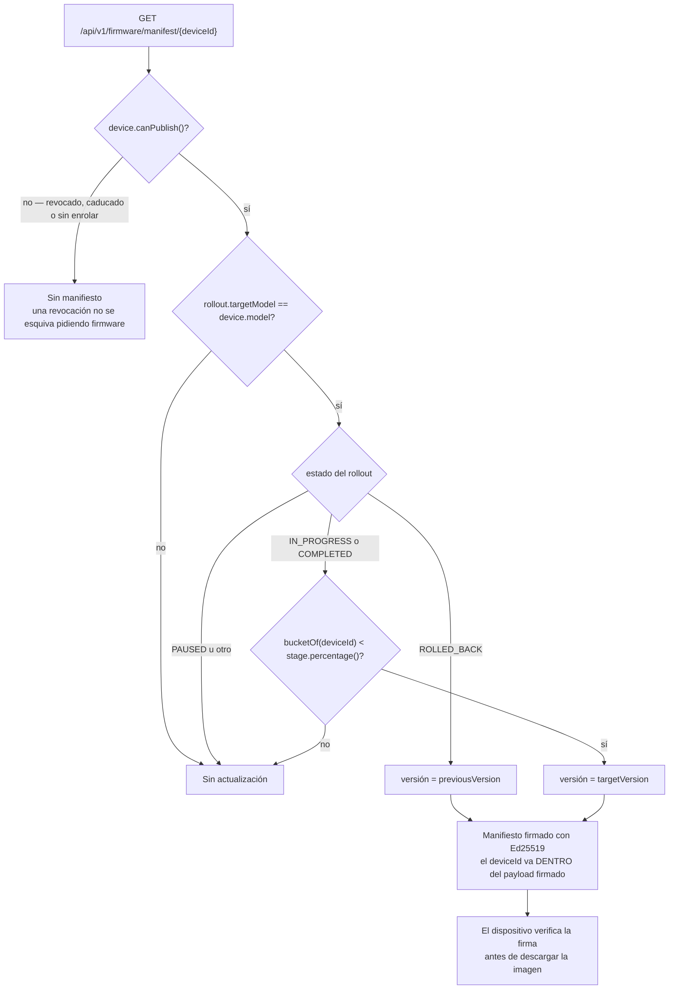
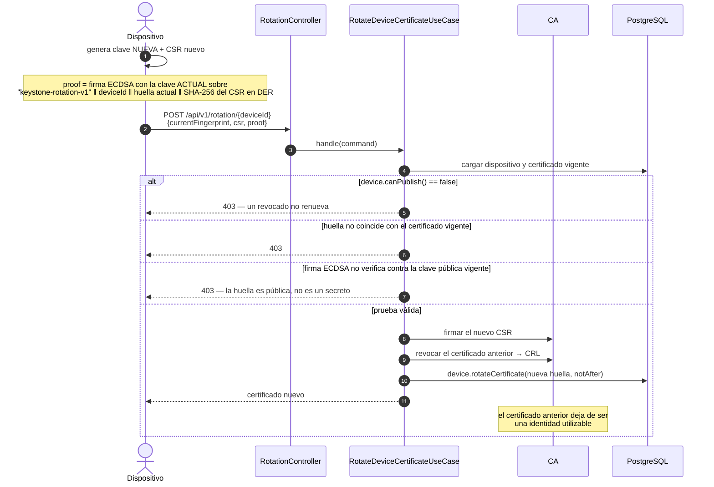
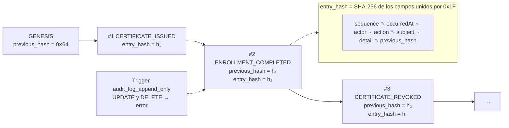

# Keystone

Control plane de identidad criptográfica y actualizaciones OTA para flotas de dispositivos IoT.

Keystone no recoge telemetría: gestiona **quién es** cada dispositivo y **qué firmware puede
ejecutar**. Emite y revoca certificados X.509 con su propia CA, controla el enrolamiento
mediante tokens de un solo uso, firma los artefactos de firmware y despliega actualizaciones
por cohortes con rollback.

## Demo

Recorrido completo del ciclo de vida: registro, enrolamiento, verificación de la cadena,
rotación con proof of possession, publicación de firmware firmado, despliegue por cohortes
y verificación de la cadena de auditoría.

https://github.com/user-attachments/assets/4ba67ffe-b369-4bb9-b658-b71dc7ed7610

Para reproducirlo en tu máquina: `./demo.sh --presentation --keep`.

## Stack

| Capa | Tecnología |
|---|---|
| Lenguaje | Java 25 (LTS) |
| Framework | Spring Boot 4.1 (Spring Framework 7) |
| Persistencia | PostgreSQL 17 + Flyway |
| PKI | Bouncy Castle 1.85 |
| Mensajería | MQTT 5 sobre mTLS (Eclipse Paho + Mosquitto) |
| Consola | Thymeleaf server-rendered, CSS con tokens propios |
| Tests | JUnit 5, AssertJ, Testcontainers 2, ArchUnit, MockMvc |

## Arquitectura

Hexagonal (puertos y adaptadores), con las capas separadas en **módulos Maven** para que la
dirección de las dependencias la garantice el compilador, no la disciplina:



Diez puertos de entrada y doce de salida son el único contrato entre el núcleo y el
mundo exterior. Nada del núcleo conoce a quien lo llama ni a quien le responde:



`HexagonalArchitectureTest` convierte esas reglas en tests: el build falla si el dominio
importa Spring o JPA, o si un controlador accede directamente a la persistencia.

> El adaptador MQTT del control plane **no publica**: exporta a disco el certificado de
> servidor del broker, la cadena de la CA y la CRL (`BrokerTrustMaterialExporter`), que
> Mosquitto monta en solo lectura. El único cliente Paho del repositorio vive en
> `keystone-simulator`, que es quien ejerce el listener mTLS.

## Arranque local

La ruta recomendada es el demo reproducible, que genera credenciales efímeras y todo el
material criptográfico en cada ejecución:

```bash
./demo.sh --keep
```

`--keep` deja la consola levantada en `http://localhost:8080` para capturas o grabación.
La contraseña temporal del operador se imprime al final del script. **No hay contraseñas
de desarrollo reutilizables en el repositorio.**

Para un arranque manual debes proporcionar, como mínimo, secretos explícitos:

```bash
export KEYSTONE_DB_PASSWORD="$(openssl rand -hex 24)"
export KEYSTONE_CA_PASSWORD="$(openssl rand -hex 32)"
export KEYSTONE_OPERATOR_PASSWORD="$(openssl rand -hex 24)"
export KEYSTONE_COOKIE_SECURE=false   # solo para localhost HTTP

docker compose up -d postgres
mvn verify
mvn -pl keystone-bootstrap spring-boot:run
```

El control plane escucha en `127.0.0.1` por defecto. PostgreSQL y el listener mTLS de
Mosquitto también se publican únicamente en loopback en el `docker-compose.yml` de
desarrollo; exponerlos a una red exige una decisión explícita de despliegue.



## Roadmap

- [x] Fase 1 — Inventario de dispositivos, dominio, esquema, consola web y tests de arquitectura
- [x] Fase 1b — Endurecido de la consola: CSRF explícito, cabeceras de seguridad, cookies, auditoría de autenticación, página de error propia
- [x] Fase 2 — CA con jerarquía root + issuing (EC P-256), firma de CSR con verificación de posesión, revocación y CRL
- [x] Fase 3 — Enrolamiento con token de un solo uso, auditoría encadenada por hash y stream de eventos en vivo (SSE)
- [x] Fase 3b — Simulador de flota en Java con hilos virtuales y escenarios adversarios
- [x] Fase 4 — mTLS real contra Mosquitto: certificado de servidor emitido por la CA, require_certificate, CRL refrescada cada 5 min y ACL por device id
- [x] Fase 5 — OTA: artefactos firmados con Ed25519, manifiestos por dispositivo, cohortes 5/25/100 y rollback
- [x] Fase 6 — Auditoría encadenada por hash con verificación de integridad y trigger append-only en Postgres

## Enrolamiento

El token es de un solo uso y se consume con un **compare-and-set en la base de datos**,
antes de que la CA firme nada. Ninguna carrera concurrente produce dos certificados.



El agregado `Device` es quien impone las transiciones; no hay forma de saltárselas desde
un servicio o un controlador:



## Probar el enrolamiento de punta a punta

```bash
# 1. Registra un dispositivo en la consola y emite su token en /enrollment
# 2. Genera una clave y un CSR como haría el dispositivo
openssl ecparam -name prime256v1 -genkey -noout -out device.key
openssl req -new -key device.key -subj "/CN=device" -out device.csr

# 3. Enrólalo
curl -X POST http://localhost:8080/api/v1/enrollment \
  -H 'Content-Type: application/json' \
  -d "{\"secret\":\"EL_TOKEN\",\"csr\":$(jq -Rs . < device.csr)}"

# 4. Verifica la cadena
curl http://localhost:8080/api/v1/enrollment/ca-chain > ca-chain.pem
openssl verify -CAfile ca-chain.pem device.crt
```

Reintentar el paso 3 con el mismo token devuelve 403: es de un solo uso.

## Simulador de flota

Enrola N dispositivos concurrentemente, cada uno en su propio hilo virtual, y después
ejecuta cuatro escenarios adversarios que deben ser rechazados.

```bash
# con la aplicación corriendo en otra terminal
mvn -pl keystone-simulator -am spring-boot:run

# más carga
mvn -pl keystone-simulator spring-boot:run -Dspring-boot.run.arguments=--simulator.device-count=500
```

Cada dispositivo simulado genera su propia clave EC P-256 y su CSR: la clave privada
nunca sale del proceso, igual que no saldría del elemento seguro de un ESP32.

## OTA

```bash
# publicar una imagen (queda firmada en la misma operación)
curl -u "operator:${KEYSTONE_OPERATOR_PASSWORD}" -X POST http://localhost:8080/api/v1/firmware \
  -F version=1.1.0 -F model=SIM-ESP32-S3 -F file=@firmware.bin

# desplegar al 5%, luego avanzar
curl -u "operator:${KEYSTONE_OPERATOR_PASSWORD}" -X POST http://localhost:8080/api/v1/firmware/rollouts/<artifactId>
curl -u "operator:${KEYSTONE_OPERATOR_PASSWORD}" -X POST http://localhost:8080/api/v1/firmware/rollouts/<rolloutId>/advance

# lo que ve un dispositivo
curl -u "operator:${KEYSTONE_OPERATOR_PASSWORD}" http://localhost:8080/api/v1/firmware/manifest/<deviceId>
```

Un rollout **siempre abre en canary**: no existe un camino directo al 100%.



La pertenencia a cohorte se **calcula**, no se almacena: el bucket sale de los dos
primeros bytes de `SHA-256(rolloutId + ":" + deviceId)` reducidos módulo 100. Es estable
(un dispositivo no entra y sale del canary entre sondeos), uniforme (el canary es una
muestra real de la flota, no los cinco primeros registrados), está ligado al rollout —sin
mezclar el `rolloutId` en el hash, los mismos desafortunados serían el canary siempre— y
no cuesta filas: un despliegue sobre cien mil dispositivos vale lo mismo que sobre diez.

Lo que decide qué ve un dispositivo al pedir su manifiesto:



## Rotación de certificados

Los certificados de dispositivo duran 90 días. La renovación no confía en la huella
del certificado como si fuera un secreto: una huella es información pública. Keystone
exige una **proof of possession** firmada con la clave privada del certificado vigente.
La firma queda ligada al `deviceId`, la huella actual y el SHA-256 de la forma DER
canónica del nuevo CSR. No se firma el texto PEM, para que los saltos de línea LF/CRLF
o una serialización JSON distinta no invaliden la prueba.



Se firma el **DER canónico** del CSR, no su texto PEM: así unos saltos de línea CRLF o
una serialización JSON distinta no invalidan una prueba por lo demás correcta.

Ejemplo conceptual equivalente al que ejecuta `demo.sh`:

```bash
# nuevo material que queremos instalar
openssl genpkey -algorithm EC -pkeyopt ec_paramgen_curve:P-256 -out device-new.key
openssl req -new -key device-new.key -subj '/CN=renewal' -out device-new.csr

CSR_SHA256=$(openssl req -in device-new.csr -outform DER | openssl dgst -sha256 -r | awk '{print $1}')
printf 'keystone-rotation-v1\n%s\n%s\n%s' \
  "$DEVICE_ID" "$FINGERPRINT" "$CSR_SHA256" > rotation-proof.txt

# IMPORTANTE: firma la clave ACTUAL, no device-new.key
PROOF=$(openssl dgst -sha256 -sign device.key rotation-proof.txt | openssl base64 -A)
CSR=$(jq -Rs . < device-new.csr)

curl -X POST "http://localhost:8080/api/v1/rotation/$DEVICE_ID" \
  -H 'Content-Type: application/json' \
  -d "{\"currentFingerprint\":\"$FINGERPRINT\",\"csr\":$CSR,\"proof\":\"$PROOF\"}"
```

Una firma realizada con la clave nueva/atacante devuelve `403`, aunque la huella sea
correcta. Tras una rotación válida, el certificado anterior entra en la CRL y deja de
ser una identidad utilizable.

## Auditoría

Cada entrada lleva el hash de la anterior. Alterar o borrar una fila rompe la cadena de
forma detectable, y un trigger de PostgreSQL rechaza además cualquier `UPDATE` o `DELETE`
sobre la tabla.



El separador `0x1F` no es decorativo: sin él, `("ab","c")` y `("a","bc")` producirían el
mismo hash y se podrían desplazar los límites entre campos sin romper la cadena.

## Tests

| Nivel | Cuántos | Qué cubre |
|---|---|---|
| Dominio | 30 | Invariantes del agregado, cadena de hashes, cohortes, versiones. Sin Spring, sin base de datos |
| Aplicación | 5 | Casos de uso de enrolamiento y rotación con dobles de los puertos de salida |
| Arquitectura | 6 | Reglas hexagonales verificadas con ArchUnit: el build falla si el dominio importa Spring o JPA |
| Integración | 37 | API REST, consola, CA validada con `CertPathValidator`, trigger append-only, flujo completo de enrolamiento — todo contra Postgres real vía Testcontainers |

La mayoría son **negativos**: comprueban que algo se rechaza. Token reutilizado,
secreto inventado, CSR malformado, proof-of-possession incorrecta en la rotación, POST
sin CSRF, rol insuficiente, `UPDATE` sobre el registro de auditoría y artefacto sin firmar.

Los tests de integración terminan en `*IT` y los ejecuta **Failsafe** en la fase
`integration-test`, así que necesitan un Docker en marcha para Testcontainers:

```bash
mvn test      # dominio, aplicación y arquitectura — sin Docker
mvn verify    # además, los 37 tests de integración — requiere Docker
```

Los 78 juntos tardan poco más de un minuto. El contenedor de PostgreSQL es un
**singleton** que se arranca una vez para toda la JVM y no se para entre clases: con el
ciclo de vida por clase de `@Testcontainers`, el primer IT en terminar lo apagaba
mientras Spring seguía con un contexto cacheado apuntando a un puerto ya muerto.

`./demo.sh` no ejecuta los IT por defecto —cada paso del demo recorre los mismos caminos
contra un PostgreSQL, un Mosquitto y un OpenSSL reales, que prueba estrictamente más—.
Con `--full` los añade.

## Modelo de amenazas (resumen)

| Amenaza | Mitigación |
|---|---|
| Suplantación de dispositivo | mTLS con certificado por dispositivo emitido por la CA propia |
| Reutilización del token de enrolamiento | Consumo atómico compare-and-set en PostgreSQL, hash en BD y TTL |
| Firmware manipulado | Firma Ed25519 sobre el digest, verificada antes de descargar |
| Manifiesto reproducido en otro dispositivo | El device id va dentro del payload firmado |
| Despliegue de una imagen sin firmar | El agregado Rollout lo rechaza en el arranque |
| Actualización a un dispositivo revocado | El manifiesto exige canPublish(): sin certificado válido, sin firmware |
| Dispositivo comprometido | Revocación propagada al broker vía CRL (ventana máxima: 5 min) |
| Secuestro de identidad durante rotación | Firma ECDSA con la clave privada vigente; la huella solo identifica el certificado |
| Renovación usada para esquivar una revocación | La rotación exige canPublish(): un revocado no renueva |
| Certificado ajeno o autofirmado en el broker | Único listener MQTT mTLS + `require_certificate` contra la cadena de Keystone |
| Publicación en topics ajenos | ACL sobre devices/%u/#, donde %u es el CN = device id |
| Manipulación del registro | Log encadenado por hash + trigger append-only en Postgres |
| Enumeración de tokens | Respuesta genérica ante cualquier fallo de enrolamiento |
| CSR con extensiones hostiles | El sujeto y las extensiones los fija la CA, nunca se copian del CSR |
| Robo de la base de tokens | Solo se almacena el SHA-256; el secreto en claro no existe en disco |
| Exposición accidental del entorno local | HTTP, PostgreSQL y MQTT de desarrollo ligados a loopback; sin listener MQTT anónimo |

## Licencia

MIT — ver [LICENSE](LICENSE).
