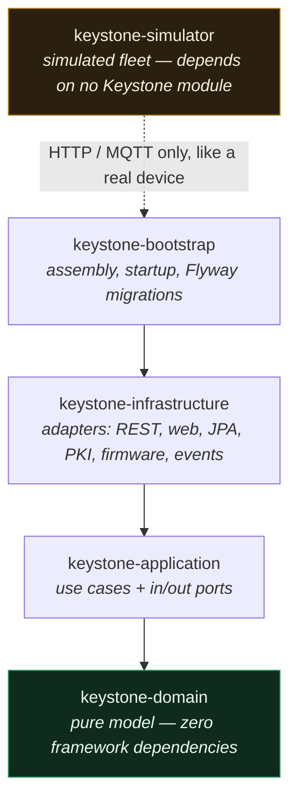
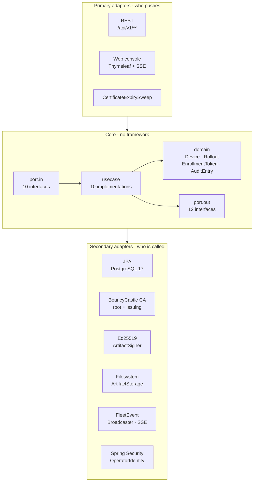
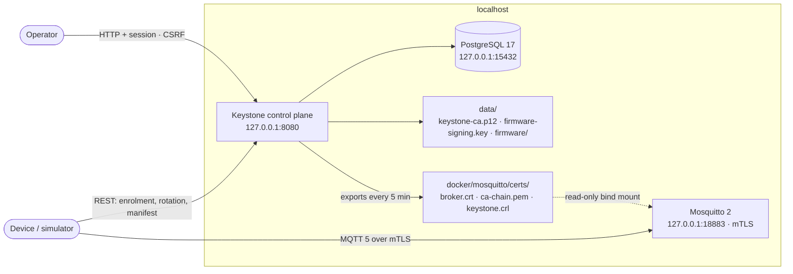
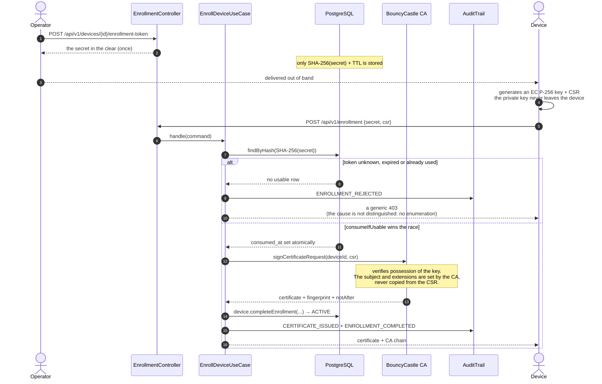
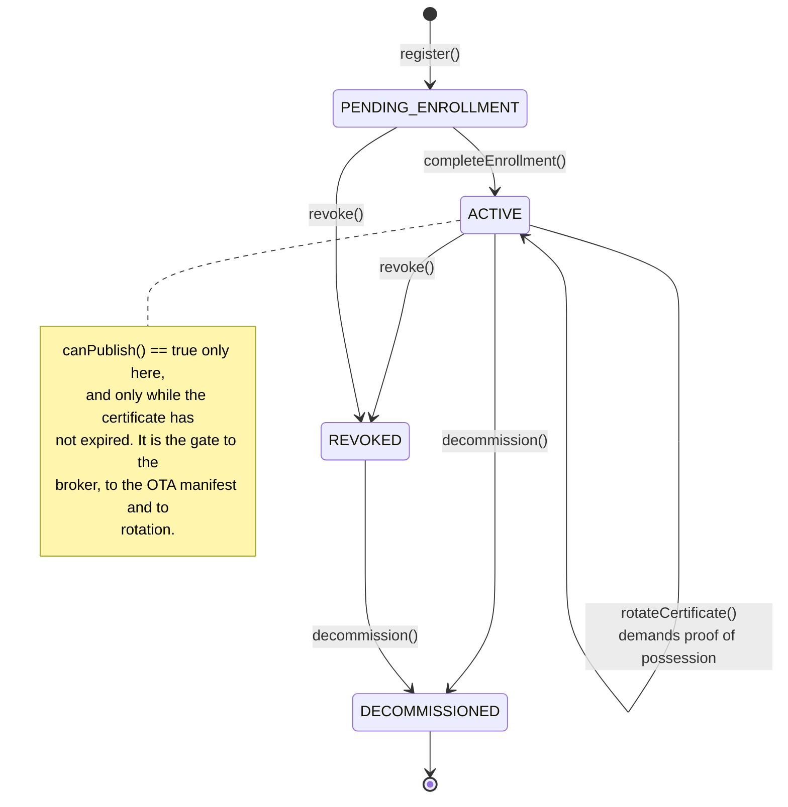
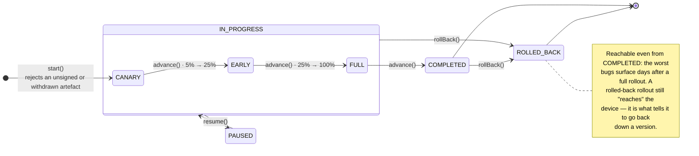
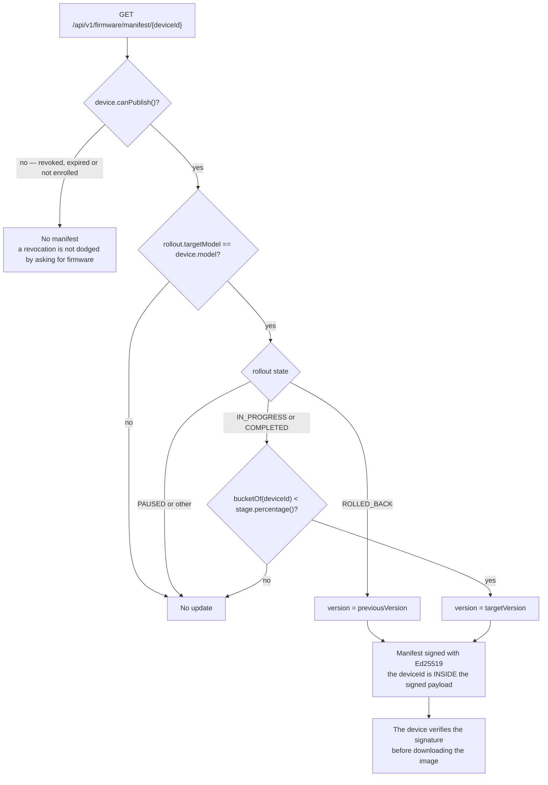
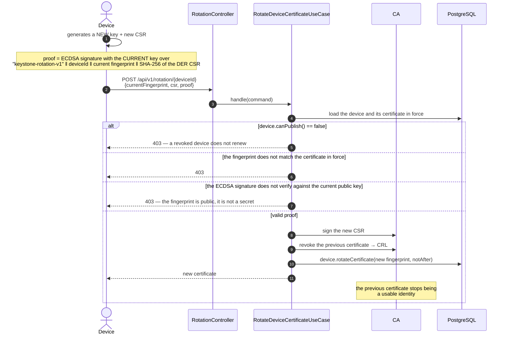
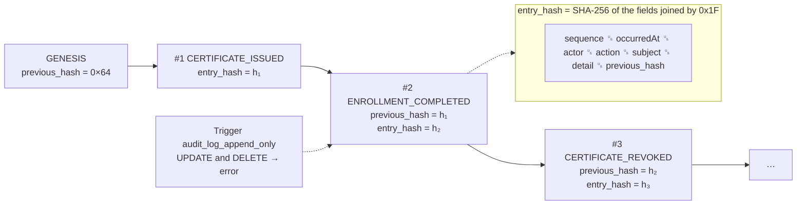

# Keystone

**Cryptographic identity and OTA update control plane for IoT fleets.**

Keystone collects no telemetry. It manages **who each device is** and **what firmware it
is allowed to run**: it issues and revokes X.509 certificates from its own CA, gates
enrolment behind single-use tokens, signs firmware artefacts, and rolls updates out in
cohorts with a way back.

https://github.com/user-attachments/assets/4ba67ffe-b369-4bb9-b658-b71dc7ed7610

<sub>The full lifecycle: registration, enrolment, chain verification, rotation with proof
of possession, signed firmware publication, cohort rollout and audit-chain verification.
Reproduce it with <code>./demo.sh --presentation --keep</code>.</sub>

---

## At a glance

|  |  |
| --- | --- |
| **What it is** | The control plane a fleet trusts: it decides which devices exist, which certificates are valid, and which firmware may run. |
| **The one idea** | Identity is a certificate the device proves it holds, not a token it can copy. Every privileged operation — enrolling, rotating, receiving firmware — is gated on a private key the device never gives up. |
| **Built with** | Java 25 · Spring Boot 4.1 · PostgreSQL 17 + Flyway · Bouncy Castle · MQTT 5 over mTLS |
| **Size** | ~7 500 lines across five Maven modules · **78 tests** |
| **Architecture** | Hexagonal, with the layers as separate Maven modules so the compiler enforces the dependency direction — and ArchUnit fails the build if it is broken |
| **Security** | Own root + issuing CA · single-use enrolment tokens · proof-of-possession rotation · Ed25519-signed firmware · hash-chained, append-only audit log |
| **Run it** | `./demo.sh --keep` → `http://localhost:8080` |

**Contents** — [Architecture](#architecture) · [Quick start](#quick-start) ·
[Enrolment](#enrolment) · [Fleet simulator](#fleet-simulator) · [OTA](#ota) ·
[Certificate rotation](#certificate-rotation) · [Audit trail](#audit-trail) ·
[Tests](#tests) · [Threat model](#threat-model)

---

## Architecture

Hexagonal — ports and adapters — with the layers as **Maven modules**, so the direction of
dependencies is guaranteed by the compiler rather than by discipline.



| Module | Responsibility | Files | Lines |
| --- | --- | --- | --- |
| `keystone-domain` | The model and its invariants: `Device`, `Rollout`, `EnrollmentToken`, `AuditEntry`. No Spring, no JPA, no framework at all | 25 | 1 219 |
| `keystone-application` | Ten use cases and the twenty-two ports that are the core's only contract with the outside | 35 | 1 264 |
| `keystone-infrastructure` | Every adapter: REST, the Thymeleaf console, JPA, the Bouncy Castle CA, firmware signing and storage, the event bus | 52 | 3 169 |
| `keystone-bootstrap` | Assembly and startup — the only module that knows the whole graph | 10 | 931 |
| `keystone-simulator` | A simulated fleet that talks HTTP and MQTT like a real device, and depends on no Keystone module | 12 | 902 |

Ten inbound ports and twelve outbound ones are the only contract between the core and the
world. Nothing in the core knows who calls it or who answers it:



`HexagonalArchitectureTest` turns those rules into tests: the build fails if the domain
imports Spring or JPA, or if a controller reaches the persistence layer directly.

> The control plane's MQTT adapter **does not publish**. It exports the broker's server
> certificate, the CA chain and the CRL to disk (`BrokerTrustMaterialExporter`), which
> Mosquitto mounts read-only. The only Paho client in the repository lives in
> `keystone-simulator` — the thing that actually exercises the mTLS listener.

### Local topology

Everything binds to loopback. Exposing any of it to a network takes a deliberate
deployment decision, not a default.



---

## Quick start

The recommended path is the reproducible demo, which generates ephemeral credentials and
all the cryptographic material on every run:

```bash
./demo.sh --keep
```

`--keep` leaves the console up at `http://localhost:8080` for screenshots or recording.
The operator's temporary password is printed at the end. **There are no reusable
development passwords in this repository.**

Starting it by hand means supplying those secrets explicitly:

```bash
export KEYSTONE_DB_PASSWORD="$(openssl rand -hex 24)"
export KEYSTONE_CA_PASSWORD="$(openssl rand -hex 32)"
export KEYSTONE_OPERATOR_PASSWORD="$(openssl rand -hex 24)"
export KEYSTONE_COOKIE_SECURE=false   # localhost HTTP only

docker compose up -d postgres
mvn verify
mvn -pl keystone-bootstrap spring-boot:run
```

---

## Stack

| Layer | Technology |
|---|---|
| Language | Java 25 (LTS) |
| Framework | Spring Boot 4.1 (Spring Framework 7) |
| Persistence | PostgreSQL 17 + Flyway |
| PKI | Bouncy Castle 1.85 |
| Messaging | MQTT 5 over mTLS (Eclipse Paho + Mosquitto) |
| Console | Server-rendered Thymeleaf, CSS with its own tokens |
| Tests | JUnit 5, AssertJ, Testcontainers 2, ArchUnit, MockMvc |

---

## Enrolment

The token is single-use and is consumed by a **compare-and-set in the database**, before
the CA signs anything. No concurrent race can produce two certificates.



The `Device` aggregate is what enforces the transitions; there is no way to skip one from
a service or a controller:



### End to end, by hand

```bash
# 1. Register a device in the console and issue its token at /enrollment
# 2. Generate a key and a CSR, as the device would
openssl ecparam -name prime256v1 -genkey -noout -out device.key
openssl req -new -key device.key -subj "/CN=device" -out device.csr

# 3. Enrol it
curl -X POST http://localhost:8080/api/v1/enrollment \
  -H 'Content-Type: application/json' \
  -d "{\"secret\":\"THE_TOKEN\",\"csr\":$(jq -Rs . < device.csr)}"

# 4. Verify the chain
curl http://localhost:8080/api/v1/enrollment/ca-chain > ca-chain.pem
openssl verify -CAfile ca-chain.pem device.crt
```

Retrying step 3 with the same token returns 403: it is single-use.

---

## Fleet simulator

Enrols N devices concurrently, each on its own virtual thread, then runs four adversarial
scenarios that must all be rejected.

```bash
# with the application running in another terminal
mvn -pl keystone-simulator -am spring-boot:run

# more load
mvn -pl keystone-simulator spring-boot:run -Dspring-boot.run.arguments=--simulator.device-count=500
```

Every simulated device generates its own EC P-256 key and CSR: the private key never
leaves the process, exactly as it would never leave an ESP32's secure element.

---

## OTA

```bash
# publish an image (it is signed in the same operation)
curl -u "operator:${KEYSTONE_OPERATOR_PASSWORD}" -X POST http://localhost:8080/api/v1/firmware \
  -F version=1.1.0 -F model=SIM-ESP32-S3 -F file=@firmware.bin

# roll out to 5%, then advance
curl -u "operator:${KEYSTONE_OPERATOR_PASSWORD}" -X POST http://localhost:8080/api/v1/firmware/rollouts/<artifactId>
curl -u "operator:${KEYSTONE_OPERATOR_PASSWORD}" -X POST http://localhost:8080/api/v1/firmware/rollouts/<rolloutId>/advance

# what a device sees
curl -u "operator:${KEYSTONE_OPERATOR_PASSWORD}" http://localhost:8080/api/v1/firmware/manifest/<deviceId>
```

A rollout **always opens in canary**: there is no direct path to 100%.



Cohort membership is **computed, not stored**: the bucket comes from the first two bytes
of `SHA-256(rolloutId + ":" + deviceId)` reduced modulo 100. That is stable — a device
does not drift in and out of the canary between polls — uniform, so the canary is a real
sample of the fleet rather than the first five devices registered, and bound to the
rollout, because without mixing the `rolloutId` into the hash the same unlucky devices
would be the canary every time. It also costs no rows: a rollout across a hundred
thousand devices costs the same as one across ten.

What decides which firmware a device is offered:



---

## Certificate rotation

Device certificates last 90 days. Renewal does not treat the certificate's fingerprint as
a secret — a fingerprint is public information. Keystone demands a **proof of possession**
signed with the private key of the certificate currently in force, bound to the
`deviceId`, the current fingerprint and the SHA-256 of the new CSR in canonical DER form.



What is signed is the CSR's **canonical DER**, not its PEM text, so CRLF line endings or a
different JSON serialisation cannot invalidate an otherwise correct proof.

The equivalent of what `demo.sh` runs:

```bash
# the new material we want to install
openssl genpkey -algorithm EC -pkeyopt ec_paramgen_curve:P-256 -out device-new.key
openssl req -new -key device-new.key -subj '/CN=renewal' -out device-new.csr

CSR_SHA256=$(openssl req -in device-new.csr -outform DER | openssl dgst -sha256 -r | awk '{print $1}')
printf 'keystone-rotation-v1\n%s\n%s\n%s' \
  "$DEVICE_ID" "$FINGERPRINT" "$CSR_SHA256" > rotation-proof.txt

# IMPORTANT: sign with the CURRENT key, not device-new.key
PROOF=$(openssl dgst -sha256 -sign device.key rotation-proof.txt | openssl base64 -A)
CSR=$(jq -Rs . < device-new.csr)

curl -X POST "http://localhost:8080/api/v1/rotation/$DEVICE_ID" \
  -H 'Content-Type: application/json' \
  -d "{\"currentFingerprint\":\"$FINGERPRINT\",\"csr\":$CSR,\"proof\":\"$PROOF\"}"
```

A signature made with the new — or an attacker's — key returns `403`, even when the
fingerprint is correct. After a valid rotation the previous certificate enters the CRL and
stops being a usable identity.

---

## Audit trail

Every entry carries the hash of the one before it. Altering or deleting a row breaks the
chain detectably, and a PostgreSQL trigger refuses any `UPDATE` or `DELETE` on the table
outright.



The `0x1F` separator is not decoration: without it, `("ab","c")` and `("a","bc")` would
hash identically, and the boundaries between fields could be shifted without breaking the
chain.

---

## Tests

| Level | How many | What it covers |
|---|---|---|
| Domain | 30 | Aggregate invariants, the hash chain, cohorts, versions. No Spring, no database |
| Application | 5 | The enrolment and rotation use cases against doubles of the outbound ports |
| Architecture | 6 | The hexagonal rules, checked with ArchUnit: the build fails if the domain imports Spring or JPA |
| Integration | 37 | The REST API, the console, the CA validated with `CertPathValidator`, the append-only trigger, the whole enrolment flow — all against a real Postgres via Testcontainers |

Most of them are **negative**: they check that something is refused. A reused token, an
invented secret, a malformed CSR, a wrong proof of possession on rotation, a POST without
CSRF, an insufficient role, an `UPDATE` on the audit log, an unsigned artefact.

Integration tests end in `*IT` and run under **Failsafe** in the `integration-test` phase,
so they need a running Docker for Testcontainers:

```bash
mvn test      # domain, application and architecture — no Docker
mvn verify    # plus the 37 integration tests — Docker required
```

All 78 take a little over a minute. The PostgreSQL container is a **singleton**, started
once for the whole JVM and never stopped between classes: with `@Testcontainers`'
per-class lifecycle, the first IT to finish shut it down while Spring carried on with a
cached context pointing at a dead port.

`./demo.sh` does not run the ITs by default — every step of the demo walks the same paths
against a real PostgreSQL, a real Mosquitto and a real OpenSSL, which proves strictly
more. `--full` adds them.

---

## Threat model

| Threat | Mitigation |
|---|---|
| Device impersonation | mTLS with a per-device certificate issued by the project's own CA |
| Enrolment token reuse | Atomic compare-and-set consumption in PostgreSQL, hashed in the database, with a TTL |
| Tampered firmware | Ed25519 signature over the digest, verified before download |
| A manifest replayed on another device | The device id is inside the signed payload |
| Rolling out an unsigned image | The Rollout aggregate refuses it at start |
| Updating a revoked device | The manifest demands canPublish(): no valid certificate, no firmware |
| A compromised device | Revocation propagated to the broker by CRL (worst-case window: 5 min) |
| Identity hijack during rotation | ECDSA signature with the private key in force; the fingerprint only identifies the certificate |
| Renewal used to dodge a revocation | Rotation demands canPublish(): a revoked device does not renew |
| A foreign or self-signed certificate at the broker | A single mTLS MQTT listener with `require_certificate` against Keystone's chain |
| Publishing on someone else's topics | ACL over devices/%u/#, where %u is the CN = device id |
| Tampering with the record | Hash-chained log plus an append-only trigger in Postgres |
| Token enumeration | A generic response to any enrolment failure |
| A CSR carrying hostile extensions | The subject and extensions are set by the CA, never copied from the CSR |
| Theft of the token store | Only the SHA-256 is stored; the secret in the clear exists nowhere on disk |
| Accidental exposure of the local environment | Development HTTP, PostgreSQL and MQTT bound to loopback; no anonymous MQTT listener |

---

## Roadmap

- [x] Phase 1 — Device inventory, domain, schema, web console and architecture tests
- [x] Phase 1b — Console hardening: explicit CSRF, security headers, cookies, authentication auditing, a custom error page
- [x] Phase 2 — A root + issuing CA hierarchy (EC P-256), CSR signing with proof of possession, revocation and CRL
- [x] Phase 3 — Enrolment with a single-use token, a hash-chained audit trail and a live event stream (SSE)
- [x] Phase 3b — A Java fleet simulator on virtual threads, with adversarial scenarios
- [x] Phase 4 — Real mTLS against Mosquitto: a server certificate issued by the CA, `require_certificate`, a CRL refreshed every 5 minutes and a per-device-id ACL
- [x] Phase 5 — OTA: Ed25519-signed artefacts, per-device manifests, 5/25/100 cohorts and rollback
- [x] Phase 6 — A hash-chained audit trail with integrity verification and an append-only trigger in Postgres

Every phase is shipped. See [`SECURITY.md`](SECURITY.md) for the disclosure policy.

---

## License

MIT — see [LICENSE](LICENSE).
